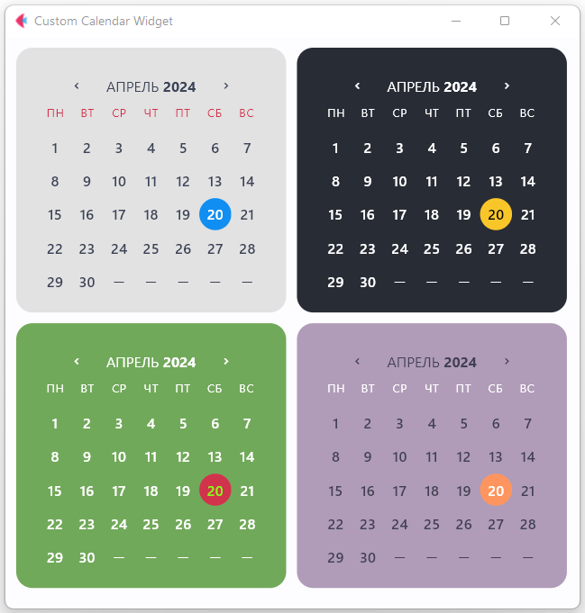

Кастомный виджет для отображения календаря в интерфейсе Flet UI.  
  
Атрибуты:
* **width** - ширина виджета в пикселях, целое число.
* **bgcolor** - цвет фона, строка c шестнадцетиричным кодом (например, #ffffff).
* **font_color** - цвет шрифта, строка c шестнадцетиричным кодом.
* **font_color_accent** - цвет шрифта для сегодняшнего дня, строка c шестнадцетиричным кодом.
* **accent_color** - цвет маркера для сегодняшнего дня, строка c шестнадцетиричным кодом. 
* **header_font_color** - цвет шрифта для заголовка календаря, строка c шестнадцетиричным кодом.
* **hover_color** - цвет при наведении курсором мыши на определённую дату в календаре.
* **border_radius** - целое число, задаёт скругление углов календаря.
